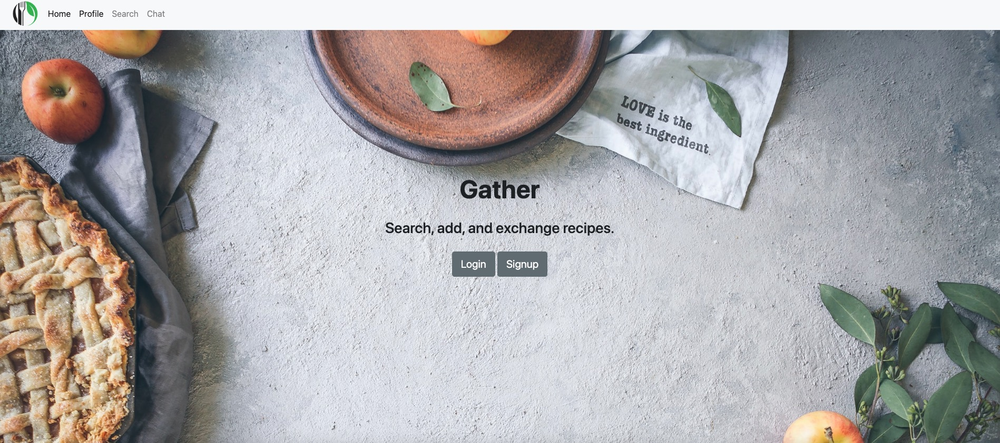

# My Recipes Book

## Dashboard

## Architecture

## Chatbox

# My Recipes Book

My Recipes Book is a project that allows users to manage their collection of recipes, search for new recipes, and interact with a chatbot for recipe-related queries. It also includes a recommendation system powered by Amazon Personalize and a barter feature for arranging food exchange meetups.

## Features

- Search for recipes: Users can search for recipes using single or double keyword searches, making it easy to find specific dishes or ingredients.
- View and save recipes: Once a recipe is found, users can view its details, including ingredients, instructions, and cooking time. They also have the option to save recipes for future reference.
- Add custom recipes: Users can add their own custom recipes to the app, allowing them to keep track of their personal favorites and unique creations.
- Chatbot: The chatbot feature enables users to interact with a conversational agent to get recipe recommendations, ask cooking-related questions, or receive assistance with their culinary endeavors. The chatbot supports both text-based and voice-based interactions.
- Recommendation system: Powered by Amazon Personalize, the recommendation system analyzes user preferences and provides personalized recipe suggestions based on their previous interactions and saved recipes.
- Barter: The barter feature allows users to arrange meetups for food exchange. They can connect with other users interested in trading their homemade dishes, fostering a sense of community and culinary exploration.

## Tech Stack
- Backend: AWS Lambda, Python
- Frontend: HTML, CSS, JavaScript
- Database: Amazon DynamoDB
- Chatbot: Natural Language Processing (NLP) algorithms
- Recommendation System: Amazon Personalize
- Map Integration: Mapbox API
- Version Control: Git

## Folder Structure

The project's folder structure is organized as follows:

- `.idea`: Directory containing project-specific configurations and settings.
- `Spoonacular`: Directory with recipe-related functionalities and user profiles.
- `load-recipe-mapbox`: Directory housing Lambda functions created by Bornita, responsible for handling recipe loading and map-related operations.
- `recipe_insert`: Directory for updating the Lambda function responsible for inserting recipes.
- `recipe_search`: Directory for updating the Lambda function responsible for recipe searches.
- `save_recipe`: Directory for updating the Lambda function responsible for saving recipes.
- `search-recipe-ID`: Directory for updating the Lambda function responsible for searching recipes by ID.
- `add_new_recipe2.py`: File containing fixes for search and add recipe Lambda functions.
- `barterNotification.py`: File containing Lambda functions created by Bornita, handling barter-related notifications.
- `load-fav.py`: File for updating the `load-fav` Lambda function.
- `load-profile.py`: File containing Lambda functions created by Bornita, linking user profiles to recipes.
- `load-recipe.py`: File containing Lambda functions created by Bornita, handling recipe loading.
- `personalize.py`: File linking user profiles to the recommendation system.
- `search_for_recipes2.py`: File responsible for searching recipes within the application.

## Getting Started

To run the My Recipes Book project locally, follow these steps:

1. Clone the repository to your local machine.
2. Set up the necessary dependencies and environment variables.
3. Run the project using the preferred development environment or command-line tool.
4. Access the application through the provided URL or local server.

Please refer to the project documentation or specific directories/files for more detailed instructions on configuration and setup.

## License

This project is licensed under the [MIT License](LICENSE.txt).

